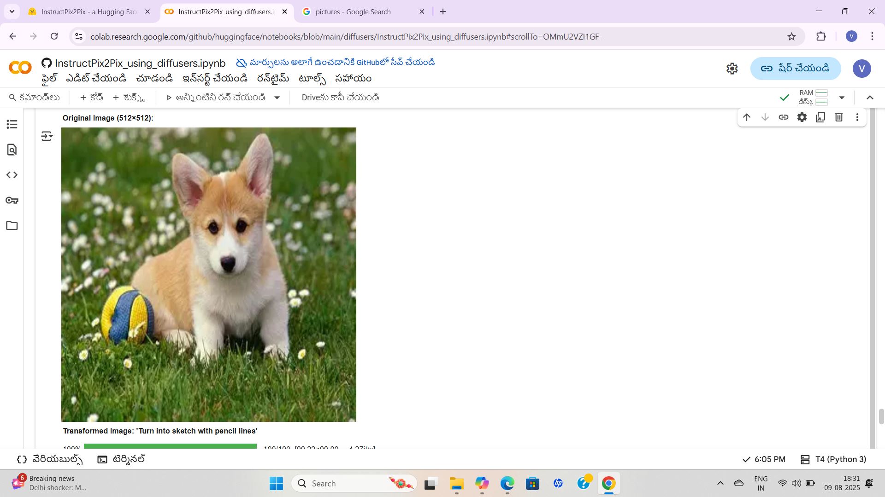
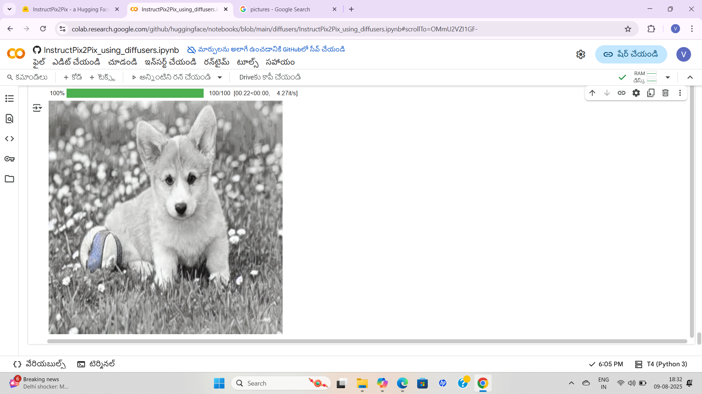

# PRODIGY_GA_04
Transform images with creative prompts using an interactive Colab UI.
# 🖼️ Image Transformation UI with Creative Prompts

An interactive image transformation tool built in Google Colab. Upload your image or paste a URL, choose from 20+ creative prompts, and instantly preview the transformed result.

## 🚀 Features
- 📤 Upload or paste image URL
- 🎨 Choose from 20+ transformation styles (anime, pixel art, cyberpunk, etc.)
- ⚡ Instant preview of original and transformed image
- ✅ Output quality check to avoid bad results

## 📸 Screenshots

### 🔧 UI Preview


### ✨ Transformed Output


## 🔗 Try it on Google Colab
[](https://colab.research.google.com/drive/1bn0gvWkaDbq7kZ8o_ABbZ2J_TcuN20vl)

## 📦 Installation (for local use)
```bash
pip install -r requirements.txt
